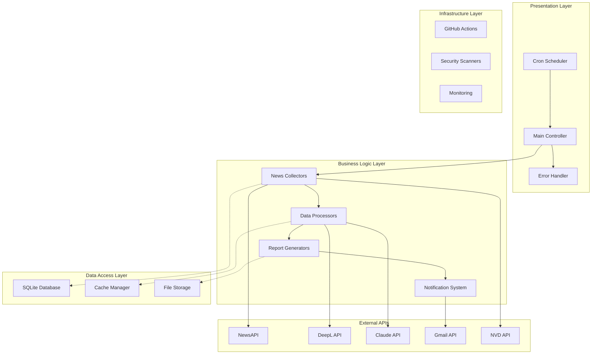
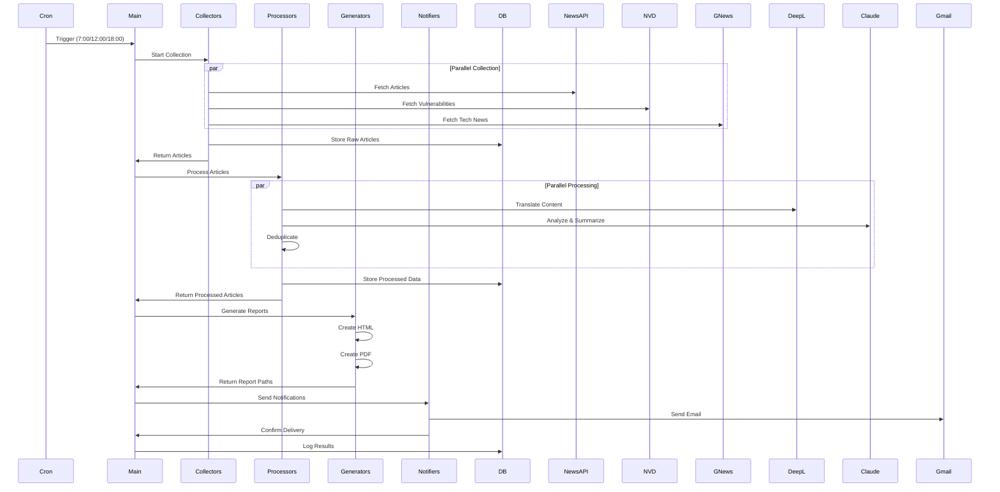
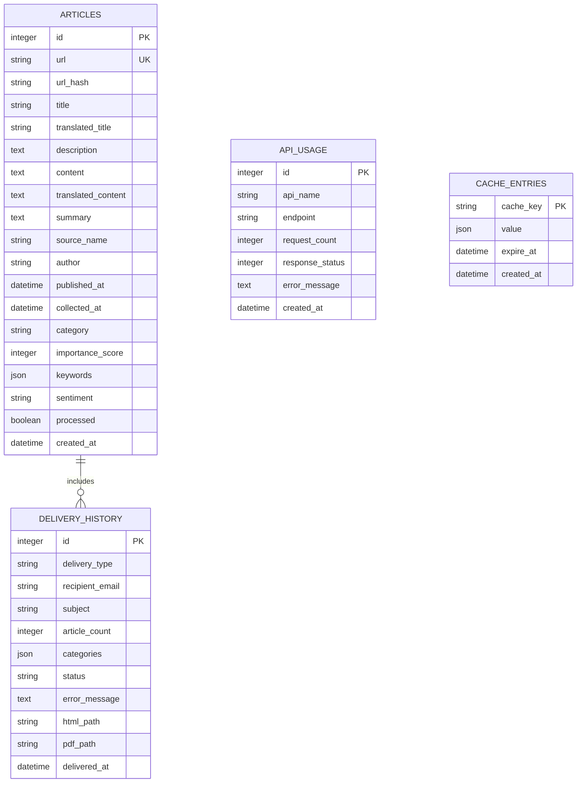
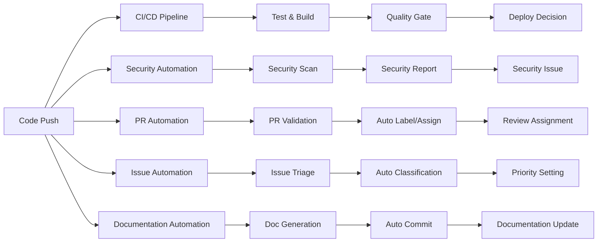

# 🏗️ アーキテクチャ詳細

## 📋 **システム全体概要**

ニュース配信システムは、**マイクロサービス型アーキテクチャ**と**イベント駆動型設計**を採用した高度な自動化システムです。

### **設計思想**
- **モジュラリティ**: 各機能を独立したモジュールとして設計
- **スケーラビリティ**: 容易な機能追加・拡張が可能
- **信頼性**: 冗長化とエラー耐性を重視
- **自動化**: GitHub Actionsによる完全CI/CD統合

---

## 🔄 **システムアーキテクチャ図**

### **レイヤーアーキテクチャ**



### **データフロー詳細**



---

## 🧩 **モジュール詳細設計**

### **1. 🗂️ Collectors (ニュース収集層)**

#### **BaseCollector (抽象基底クラス)**
```python
class BaseCollector(ABC):
    """ニュース収集器の基底クラス"""
    
    def __init__(self, api_key: str, cache_manager: CacheManager):
        self.api_key = api_key
        self.cache = cache_manager
        self.session = None
        
    @abstractmethod
    async def collect(self, category: str, count: int) -> List[Article]:
        """ニュース収集の実装"""
        pass
        
    async def fetch_with_cache(self, url: str, params: dict) -> dict:
        """キャッシュ付きHTTPリクエスト"""
        cache_key = self._generate_cache_key(url, params)
        
        # キャッシュ確認
        cached_data = await self.cache.get(cache_key)
        if cached_data:
            return cached_data
            
        # API呼び出し
        async with self.session.get(url, params=params) as response:
            data = await response.json()
            
        # キャッシュ保存
        await self.cache.set(cache_key, data, ttl=3600)
        return data
```

#### **NewsAPICollector (NewsAPI連携)**
```python
class NewsAPICollector(BaseCollector):
    """NewsAPI専用収集器"""
    
    BASE_URL = "https://newsapi.org/v2"
    RATE_LIMIT = 1000  # requests/day
    
    async def collect(self, category: str, count: int) -> List[Article]:
        """カテゴリ別ニュース収集"""
        
        # レート制限チェック
        if await self._check_rate_limit():
            raise RateLimitError("NewsAPI rate limit exceeded")
            
        # パラメータ構築
        params = self._build_params(category, count)
        
        # データ取得
        data = await self.fetch_with_cache(
            f"{self.BASE_URL}/everything", 
            params
        )
        
        # Article オブジェクト変換
        articles = []
        for article_data in data.get('articles', []):
            article = Article(
                title=article_data.get('title'),
                description=article_data.get('description'),
                url=article_data.get('url'),
                source=article_data.get('source', {}).get('name'),
                published_at=article_data.get('publishedAt'),
                category=category,
                raw_data=article_data
            )
            articles.append(article)
            
        return articles
        
    def _build_params(self, category: str, count: int) -> dict:
        """カテゴリ別パラメータ生成"""
        base_params = {
            'apiKey': self.api_key,
            'pageSize': count,
            'sortBy': 'relevancy',
            'language': 'ja' if 'domestic' in category else 'en'
        }
        
        # カテゴリ別設定
        category_config = {
            'domestic_social': {
                'country': 'jp',
                'category': 'general'
            },
            'international_social': {
                'q': 'human rights OR social justice OR migration',
                'domains': 'bbc.co.uk,reuters.com,ap.org'
            },
            'tech': {
                'q': 'artificial intelligence OR machine learning OR technology',
                'domains': 'techcrunch.com,arstechnica.com,wired.com'
            },
            'security': {
                'q': 'cybersecurity OR vulnerability OR data breach',
                'domains': 'krebsonsecurity.com,threatpost.com'
            }
        }
        
        base_params.update(category_config.get(category, {}))
        return base_params
```

### **2. ⚙️ Processors (データ処理層)**

#### **TranslationProcessor (翻訳処理)**
```python
class DeepLTranslator:
    """DeepL API翻訳処理"""
    
    def __init__(self, api_key: str):
        self.api_key = api_key
        self.base_url = "https://api-free.deepl.com/v2/translate"
        self.batch_size = 50
        self.cache = CacheManager()
        
    async def translate_batch(self, articles: List[Article]) -> List[Article]:
        """バッチ翻訳処理"""
        
        # 翻訳対象記事フィルタリング
        translation_targets = [
            article for article in articles 
            if self._needs_translation(article)
        ]
        
        # バッチ処理
        batches = self._create_batches(translation_targets, self.batch_size)
        
        tasks = []
        for batch in batches:
            task = asyncio.create_task(self._translate_batch(batch))
            tasks.append(task)
            
        # 並列実行
        translated_batches = await asyncio.gather(*tasks)
        
        # 結果マージ
        translated_articles = []
        for batch in translated_batches:
            translated_articles.extend(batch)
            
        return translated_articles
        
    async def _translate_batch(self, articles: List[Article]) -> List[Article]:
        """単一バッチの翻訳"""
        
        # 翻訳テキスト抽出
        texts = []
        for article in articles:
            texts.extend([article.title, article.description or ""])
            
        # DeepL API呼び出し
        async with aiohttp.ClientSession() as session:
            async with session.post(
                self.base_url,
                headers={'Authorization': f'DeepL-Auth-Key {self.api_key}'},
                data={
                    'text': texts,
                    'source_lang': 'EN',
                    'target_lang': 'JA',
                    'formality': 'default'
                }
            ) as response:
                result = await response.json()
                
        # 翻訳結果適用
        translations = result['translations']
        for i, article in enumerate(articles):
            article.translated_title = translations[i*2]['text']
            article.translated_description = translations[i*2+1]['text']
            
        return articles
```

#### **AIAnalyzer (AI分析処理)**
```python
class ClaudeAnalyzer:
    """Claude API分析処理"""
    
    def __init__(self, api_key: str):
        self.client = anthropic.Client(api_key=api_key)
        self.cache = CacheManager()
        self.semaphore = asyncio.Semaphore(5)  # 並行数制限
        
    async def analyze_batch(self, articles: List[Article]) -> List[Article]:
        """バッチAI分析"""
        
        # 重要度で優先順位付け
        prioritized = self._prioritize_articles(articles)
        
        # 高優先度記事はClaude分析
        high_priority = prioritized[:20]
        low_priority = prioritized[20:]
        
        # 並列分析実行
        tasks = []
        for article in high_priority:
            task = asyncio.create_task(
                self._analyze_with_semaphore(article)
            )
            tasks.append(task)
            
        analyzed_high = await asyncio.gather(*tasks)
        
        # 低優先度は簡易分析
        analyzed_low = [
            self._simple_analyze(article) 
            for article in low_priority
        ]
        
        return analyzed_high + analyzed_low
        
    async def _analyze_with_semaphore(self, article: Article) -> Article:
        """セマフォ制御付き分析"""
        async with self.semaphore:
            return await self._analyze_article(article)
            
    async def _analyze_article(self, article: Article) -> Article:
        """単一記事の詳細分析"""
        
        # キャッシュ確認
        cache_key = f"analysis:{hashlib.md5(article.url.encode()).hexdigest()}"
        cached_analysis = await self.cache.get(cache_key)
        
        if cached_analysis:
            return self._apply_analysis(article, cached_analysis)
            
        # Claude API分析
        prompt = self._create_analysis_prompt(article)
        
        try:
            response = await asyncio.to_thread(
                self.client.messages.create,
                model="claude-3-sonnet-20240229",
                max_tokens=1000,
                messages=[{"role": "user", "content": prompt}]
            )
            
            # JSON解析
            content = response.content[0].text
            analysis = json.loads(self._extract_json(content))
            
            # 結果適用
            article.summary = analysis.get('summary', '')
            article.importance_score = analysis.get('importance_score', 5)
            article.keywords = analysis.get('keywords', [])
            article.sentiment = analysis.get('sentiment', 'neutral')
            
            # キャッシュ保存
            await self.cache.set(cache_key, analysis, ttl=604800)  # 7日間
            
        except Exception as e:
            logger.error(f"Claude analysis error: {e}")
            article = self._simple_analyze(article)
            
        return article
        
    def _create_analysis_prompt(self, article: Article) -> str:
        """分析プロンプト生成"""
        title = article.translated_title or article.title
        content = article.translated_description or article.description
        
        return f"""
以下のニュース記事を分析してください。

タイトル: {title}
内容: {content}
カテゴリ: {article.category}

以下のJSON形式で回答してください:
{{
    "summary": "200-250文字の要約",
    "importance_score": 1-10の重要度スコア,
    "keywords": ["キーワード1", "キーワード2", "キーワード3", "キーワード4", "キーワード5"],
    "sentiment": "positive/neutral/negative",
    "key_points": ["ポイント1", "ポイント2", "ポイント3"],
    "urgency": "high/medium/low"
}}

分析基準:
- 重要度: 社会影響度、緊急性、関心度を総合評価
- キーワード: 記事の核心を表す5つの重要語句
- センチメント: 記事の論調・感情的傾向
"""
```

### **3. 📊 Generators (レポート生成層)**

#### **HTMLReportGenerator**
```python
class HTMLReportGenerator:
    """HTML形式レポート生成"""
    
    def __init__(self, template_dir: str):
        self.env = Environment(
            loader=FileSystemLoader(template_dir),
            autoescape=select_autoescape(['html', 'xml'])
        )
        self.template = self.env.get_template('email_template.html')
        
    def generate(self, articles: List[Article], metadata: dict) -> str:
        """HTMLレポート生成"""
        
        # データ前処理
        categorized = self._categorize_articles(articles)
        stats = self._generate_statistics(articles)
        alerts = self._extract_urgent_alerts(articles)
        
        # テンプレート変数準備
        context = {
            'metadata': metadata,
            'statistics': stats,
            'categories': categorized,
            'urgent_alerts': alerts,
            'generation_time': datetime.now(),
            'total_articles': len(articles),
            'system_info': self._get_system_info()
        }
        
        # HTML生成
        html_content = self.template.render(**context)
        
        # 最適化
        html_content = self._optimize_html(html_content)
        
        return html_content
        
    def _categorize_articles(self, articles: List[Article]) -> dict:
        """カテゴリ別記事整理"""
        categories = {
            '緊急アラート': [],
            '国内社会': [],
            '国際社会': [],
            'IT・技術': [],
            'セキュリティ': []
        }
        
        for article in articles:
            # 緊急アラート判定
            if article.importance_score >= 9 or article.urgency == 'high':
                categories['緊急アラート'].append(article)
                
            # カテゴリ分類
            category_map = {
                'domestic_social': '国内社会',
                'international_social': '国際社会',
                'tech': 'IT・技術',
                'security': 'セキュリティ'
            }
            
            category_name = category_map.get(article.category, 'その他')
            if category_name in categories:
                categories[category_name].append(article)
                
        # 各カテゴリ内で重要度順ソート
        for category in categories:
            categories[category].sort(
                key=lambda x: (x.importance_score, x.published_at),
                reverse=True
            )
            
        return categories
        
    def _generate_statistics(self, articles: List[Article]) -> dict:
        """統計情報生成"""
        return {
            'total_count': len(articles),
            'by_category': Counter(article.category for article in articles),
            'by_importance': Counter(article.importance_score for article in articles),
            'by_sentiment': Counter(article.sentiment for article in articles),
            'urgent_count': len([a for a in articles if a.importance_score >= 9]),
            'average_importance': sum(a.importance_score for a in articles) / len(articles),
            'top_keywords': self._extract_top_keywords(articles)
        }
```

---

## 💾 **データベース設計**

### **ERD (Entity Relationship Diagram)**



### **インデックス設計**
```sql
-- パフォーマンス最適化インデックス
CREATE INDEX idx_articles_published_at ON articles(published_at);
CREATE INDEX idx_articles_category ON articles(category);
CREATE INDEX idx_articles_importance ON articles(importance_score DESC);
CREATE INDEX idx_articles_url_hash ON articles(url_hash);
CREATE INDEX idx_articles_processed ON articles(processed);

-- 複合インデックス
CREATE INDEX idx_articles_category_importance 
    ON articles(category, importance_score DESC);
CREATE INDEX idx_articles_published_processed 
    ON articles(published_at, processed);

-- 配信履歴インデックス
CREATE INDEX idx_delivery_history_delivered_at 
    ON delivery_history(delivered_at);
CREATE INDEX idx_delivery_history_status 
    ON delivery_history(status);

-- API使用履歴インデックス
CREATE INDEX idx_api_usage_api_name_created 
    ON api_usage(api_name, created_at);

-- キャッシュ期限インデックス
CREATE INDEX idx_cache_expire_at ON cache_entries(expire_at);
```

---

## 🔐 **セキュリティアーキテクチャ**

### **多層防御アーキテクチャ**



```mermaid
graph TB
    subgraph "Application Security"
        A[Input Validation] --> B[Authentication]
        B --> C[Authorization]
        C --> D[Data Encryption]
    end
    
    subgraph "Infrastructure Security"
        E[Environment Variables] --> F[File Permissions]
        F --> G[Network Security]
        G --> H[Access Logging]
    end
    
    subgraph "CI/CD Security"
        I[GitHub Secrets] --> J[Security Scanning]
        J --> K[Dependency Audit]
        K --> L[Code Analysis]
    end
    
    subgraph "Runtime Security"
        M[Error Handling] --> N[Rate Limiting]
        N --> O[Monitoring]
        O --> P[Alerting]
    end
```

### **セキュリティ実装詳細**

#### **認証・認可**
```python
class SecurityManager:
    """セキュリティ管理"""
    
    @staticmethod
    def validate_api_key(api_key: str, service: str) -> bool:
        """APIキー検証"""
        
        # 形式チェック
        if not api_key or len(api_key) < 10:
            return False
            
        # サービス別検証
        patterns = {
            'newsapi': r'^[a-f0-9]{32}$',
            'deepl': r'^[a-f0-9-]{36}$',
            'anthropic': r'^sk-ant-[a-zA-Z0-9-]{32,}$'
        }
        
        pattern = patterns.get(service)
        if pattern and not re.match(pattern, api_key):
            return False
            
        return True
        
    @staticmethod
    def sanitize_input(text: str) -> str:
        """入力サニタイゼーション"""
        
        # HTMLエスケープ
        text = html.escape(text)
        
        # SQLインジェクション対策
        text = text.replace("'", "''")
        
        # XSS対策
        text = re.sub(r'<script[^>]*>.*?</script>', '', text, flags=re.IGNORECASE)
        
        return text
        
    @staticmethod
    def encrypt_sensitive_data(data: str, key: str) -> str:
        """機密データ暗号化"""
        from cryptography.fernet import Fernet
        
        f = Fernet(key.encode())
        encrypted = f.encrypt(data.encode())
        return encrypted.decode()
```

#### **レート制限**
```python
class RateLimiter:
    """API レート制限管理"""
    
    def __init__(self):
        self.limits = {
            'newsapi': {'limit': 1000, 'window': 86400},  # 1000/日
            'deepl': {'limit': 500000, 'window': 2592000},  # 500k文字/月
            'claude': {'limit': 1000, 'window': 86400}  # 1000リクエスト/日
        }
        self.usage = {}
        
    async def check_limit(self, service: str) -> bool:
        """制限チェック"""
        
        current_time = time.time()
        service_limit = self.limits.get(service, {})
        
        if service not in self.usage:
            self.usage[service] = []
            
        # 期限切れリクエスト削除
        window = service_limit.get('window', 3600)
        cutoff_time = current_time - window
        
        self.usage[service] = [
            timestamp for timestamp in self.usage[service] 
            if timestamp > cutoff_time
        ]
        
        # 制限チェック
        limit = service_limit.get('limit', 100)
        if len(self.usage[service]) >= limit:
            return False
            
        # 使用量記録
        self.usage[service].append(current_time)
        return True
```

---

## 📈 **パフォーマンス最適化**

### **非同期処理アーキテクチャ**

```python
class PerformanceOptimizer:
    """パフォーマンス最適化"""
    
    def __init__(self):
        self.connection_pool = aiohttp.TCPConnector(
            limit=100,  # 総接続数
            limit_per_host=30,  # ホスト別接続数
            ttl_dns_cache=300,  # DNS キャッシュ
            use_dns_cache=True
        )
        
    async def parallel_collect(self, collectors: List[BaseCollector]) -> List[Article]:
        """並列ニュース収集"""
        
        # セマフォで同時実行数制御
        semaphore = asyncio.Semaphore(6)
        
        async def collect_with_semaphore(collector, category, count):
            async with semaphore:
                return await collector.collect(category, count)
                
        # 収集タスク作成
        tasks = []
        for collector, config in self._get_collection_tasks():
            task = asyncio.create_task(
                collect_with_semaphore(
                    collector, 
                    config['category'], 
                    config['count']
                )
            )
            tasks.append(task)
            
        # 並列実行
        results = await asyncio.gather(*tasks, return_exceptions=True)
        
        # 結果統合
        all_articles = []
        for result in results:
            if isinstance(result, Exception):
                logger.error(f"Collection error: {result}")
                continue
            all_articles.extend(result)
            
        return all_articles
```

### **キャッシュ戦略**

```python
class CacheManager:
    """階層キャッシュ管理"""
    
    def __init__(self):
        # L1: メモリキャッシュ (高速)
        self.memory_cache = {}
        self.memory_ttl = {}
        
        # L2: ディスクキャッシュ (永続)
        self.disk_cache_dir = Path("cache")
        self.disk_cache_dir.mkdir(exist_ok=True)
        
    async def get(self, key: str) -> Optional[Any]:
        """階層キャッシュ取得"""
        
        # L1 メモリキャッシュ確認
        if key in self.memory_cache:
            if time.time() < self.memory_ttl.get(key, 0):
                return self.memory_cache[key]
            else:
                del self.memory_cache[key]
                del self.memory_ttl[key]
                
        # L2 ディスクキャッシュ確認
        cache_file = self.disk_cache_dir / f"{hashlib.md5(key.encode()).hexdigest()}.json"
        
        if cache_file.exists():
            try:
                with open(cache_file, 'r') as f:
                    cache_data = json.load(f)
                    
                if time.time() < cache_data.get('expire_at', 0):
                    value = cache_data['value']
                    # L1に昇格
                    self.memory_cache[key] = value
                    self.memory_ttl[key] = cache_data['expire_at']
                    return value
                else:
                    cache_file.unlink()  # 期限切れファイル削除
                    
            except (json.JSONDecodeError, KeyError):
                cache_file.unlink()  # 破損ファイル削除
                
        return None
        
    async def set(self, key: str, value: Any, ttl: int = 3600) -> None:
        """階層キャッシュ設定"""
        
        expire_at = time.time() + ttl
        
        # L1 メモリキャッシュ設定
        self.memory_cache[key] = value
        self.memory_ttl[key] = expire_at
        
        # L2 ディスクキャッシュ設定
        cache_file = self.disk_cache_dir / f"{hashlib.md5(key.encode()).hexdigest()}.json"
        
        cache_data = {
            'value': value,
            'expire_at': expire_at,
            'created_at': time.time()
        }
        
        with open(cache_file, 'w') as f:
            json.dump(cache_data, f, default=str)
```

---

## 🔄 **GitHub Actions CI/CD アーキテクチャ**

### **ワークフロー連携図**



### **品質ゲート実装**

```yaml
# .github/workflows/quality-gate.yml
name: Quality Gate

on:
  pull_request:
    branches: [main]
  push:
    branches: [main]

jobs:
  quality-check:
    runs-on: ubuntu-latest
    steps:
    - uses: actions/checkout@v4
    
    - name: Security Check
      run: |
        safety check
        bandit -r src/
        
    - name: Code Quality
      run: |
        flake8 src/
        mypy src/
        
    - name: Test Coverage
      run: |
        pytest --cov=src --cov-report=xml
        
    - name: Performance Test
      run: |
        python tests/performance_test.py
        
    - name: Quality Gate Decision
      run: |
        python scripts/quality_gate.py \
          --security-report security-report.json \
          --coverage-report coverage.xml \
          --performance-report performance.json
```

---

## 📊 **監視・メトリクス**

### **監視ダッシュボード設計**

```python
class MetricsCollector:
    """システムメトリクス収集"""
    
    def __init__(self):
        self.metrics = {}
        
    def collect_system_metrics(self) -> dict:
        """システムメトリクス収集"""
        
        return {
            'timestamp': datetime.now().isoformat(),
            'system': {
                'cpu_usage': psutil.cpu_percent(),
                'memory_usage': psutil.virtual_memory().percent,
                'disk_usage': psutil.disk_usage('/').percent,
                'network_io': psutil.net_io_counters()._asdict()
            },
            'application': {
                'articles_processed': self._count_articles_today(),
                'emails_sent': self._count_emails_today(),
                'api_calls': self._count_api_calls_today(),
                'cache_hit_rate': self._calculate_cache_hit_rate(),
                'error_rate': self._calculate_error_rate()
            },
            'performance': {
                'avg_collection_time': self._avg_collection_time(),
                'avg_processing_time': self._avg_processing_time(),
                'avg_delivery_time': self._avg_delivery_time()
            }
        }
        
    def generate_health_report(self) -> dict:
        """ヘルスレポート生成"""
        
        metrics = self.collect_system_metrics()
        
        health_status = {
            'overall': 'healthy',
            'components': {
                'collectors': self._check_collectors_health(),
                'processors': self._check_processors_health(),
                'generators': self._check_generators_health(),
                'notifiers': self._check_notifiers_health(),
                'database': self._check_database_health()
            },
            'alerts': [],
            'recommendations': []
        }
        
        # ヘルス判定
        if metrics['system']['cpu_usage'] > 80:
            health_status['alerts'].append('High CPU usage detected')
            health_status['overall'] = 'warning'
            
        if metrics['application']['error_rate'] > 0.05:
            health_status['alerts'].append('High error rate detected')
            health_status['overall'] = 'critical'
            
        return health_status
```

---

## 🎯 **拡張性とメンテナンス性**

### **プラグインアーキテクチャ**

```python
class PluginManager:
    """プラグイン管理システム"""
    
    def __init__(self):
        self.collectors = {}
        self.processors = {}
        self.generators = {}
        self.notifiers = {}
        
    def register_collector(self, name: str, collector_class: Type[BaseCollector]):
        """コレクター登録"""
        self.collectors[name] = collector_class
        
    def register_processor(self, name: str, processor_class: Type[BaseProcessor]):
        """プロセッサ登録"""
        self.processors[name] = processor_class
        
    def create_collector(self, name: str, **kwargs) -> BaseCollector:
        """コレクター生成"""
        if name not in self.collectors:
            raise ValueError(f"Unknown collector: {name}")
            
        return self.collectors[name](**kwargs)
        
    def get_available_plugins(self) -> dict:
        """利用可能プラグイン一覧"""
        return {
            'collectors': list(self.collectors.keys()),
            'processors': list(self.processors.keys()),
            'generators': list(self.generators.keys()),
            'notifiers': list(self.notifiers.keys())
        }
```

### **設定管理システム**

```python
class ConfigurationManager:
    """設定管理システム"""
    
    def __init__(self, config_path: str):
        self.config_path = Path(config_path)
        self.config = {}
        self.watchers = []
        
    def load_config(self) -> dict:
        """設定ファイル読み込み"""
        
        try:
            with open(self.config_path, 'r', encoding='utf-8') as f:
                self.config = json.load(f)
                
            # 環境変数での上書き
            self._apply_env_overrides()
            
            # バリデーション
            self._validate_config()
            
            return self.config
            
        except (FileNotFoundError, json.JSONDecodeError) as e:
            logger.error(f"Config load error: {e}")
            raise ConfigurationError(f"Failed to load config: {e}")
            
    def watch_config_changes(self, callback: Callable):
        """設定変更監視"""
        
        class ConfigWatcher(FileSystemEventHandler):
            def on_modified(self, event):
                if event.src_path == str(self.config_path):
                    callback()
                    
        observer = Observer()
        observer.schedule(ConfigWatcher(), str(self.config_path.parent))
        observer.start()
        
        self.watchers.append(observer)
```

このアーキテクチャにより、高い可用性、拡張性、保守性を実現し、企業レベルの運用要件を満たすシステムを構築しています。

---

**🎯 このアーキテクチャは、モジュラリティ、セキュリティ、パフォーマンス、拡張性のすべてを考慮した設計となっています。**